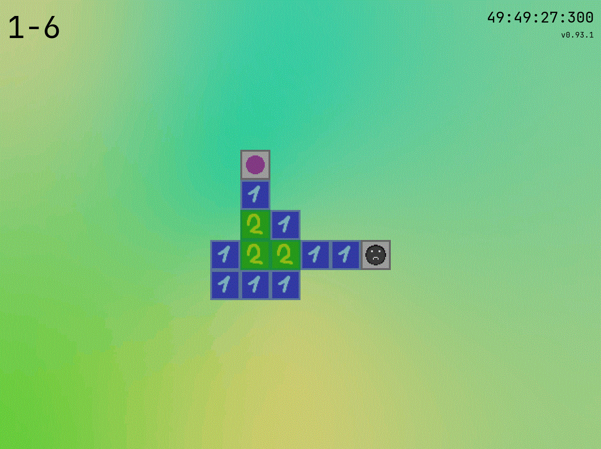
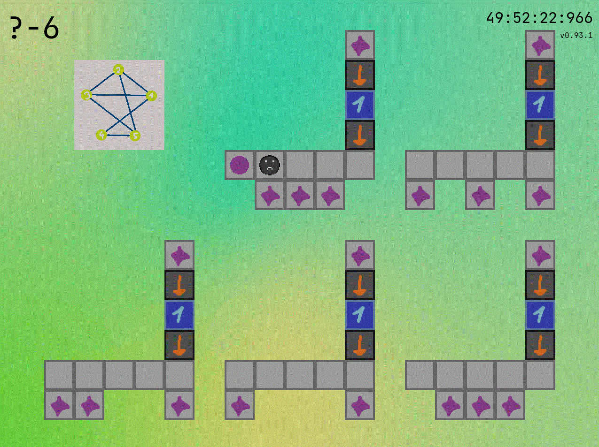
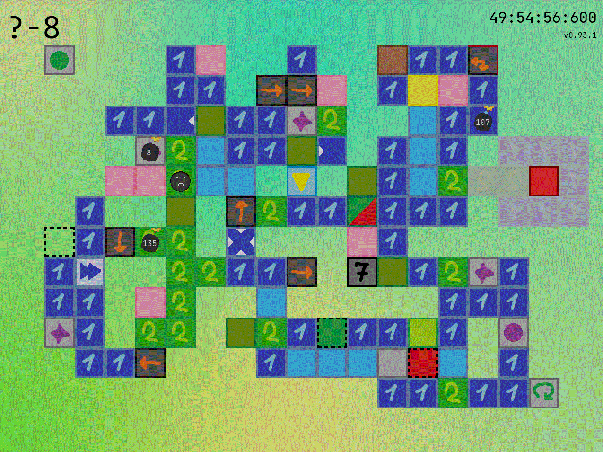
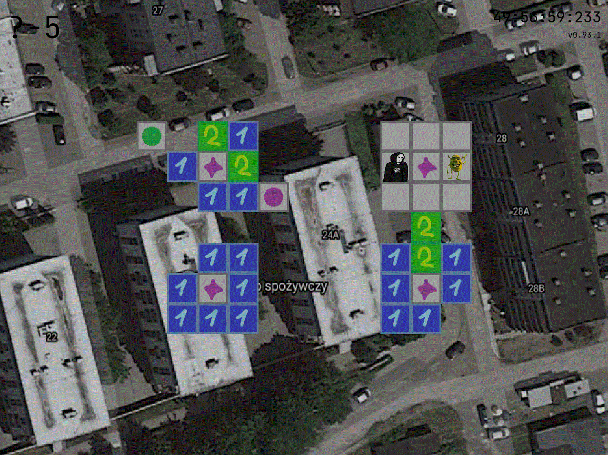

## klockilol4dupf

A puzzle game, where you have to walk over tiles the exact amount of times that is specified on them! How hard can it be?

## Engaging puzzles

## NP-Complete concept

## Overly complicated levels

## Questionable design choices

## Idea

So this is a project I've picked up while I was at my year 2 in college.  
The concept is based on a flash game I played when I was 10.  
I only found it again recently, its [Platform Maze](https://www.newgrounds.com/portal/view/360130) by Bobberticus.  
Another flash game with similar idea is Birdy's Rainy Day Skipathon by Jess Hansen (can still be found on [Flash Point](https://bluemaxima.org/flashpoint/)).  
I've integrated all mechanics and levels from both of those into my game as secondary zones.

## Installation

For Windows 10:
1) Download this repo (code -> download as .zip)
2) Create a new folder and unzip there
3) Download python (preferably 3.9.5) from the bottom of [this](https://www.python.org/downloads/release/python-395/) site
4) Run klockilol4dupf.bat (a file in "game" folder, double click, first run will likely download something and therefore last longer)

For Ubuntu:  
just clone and run launcher.py

## Controlls
W, A, S, D or arrow keys - movement  
Q or SHIFT - undo move  
R or / - reset current stage  
1,...,9 - change view mode to single layer (useless in zones 1-3)  
ESCAPE - go back in level hierarchy (Hubs contain zones, zones contain actual levels)  
ENTER - command line, list of available commands is under "help" command

Root only:  
ANGLE BRACKETS - quick level change  
L, SEMICOLON - quick level reorder  
KB and movement - fly-cheat  

## Dependencies
* numpy
* pygame
* tkinter
* pickle
