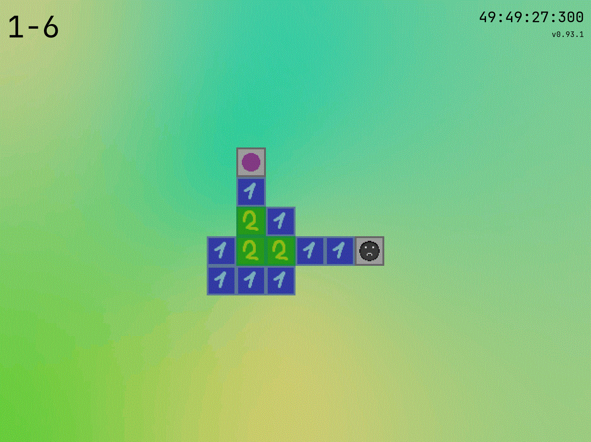
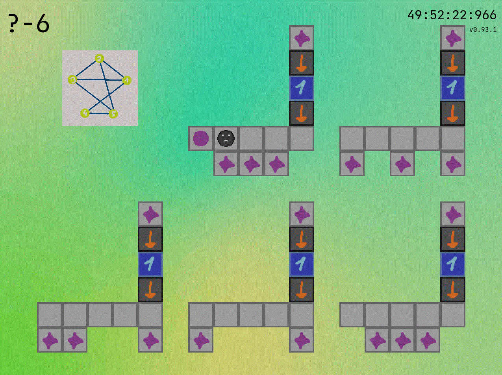
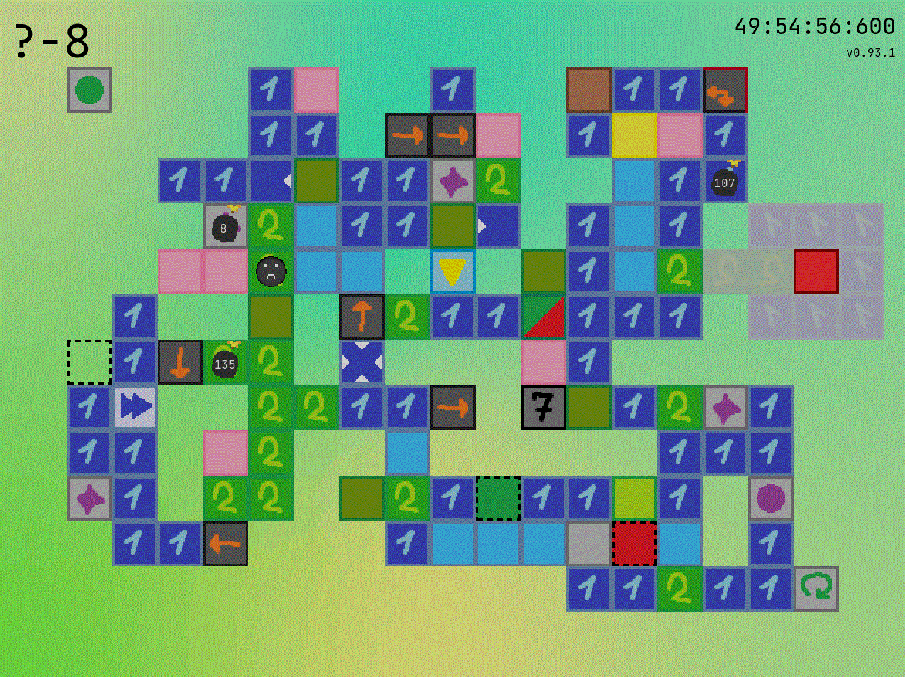
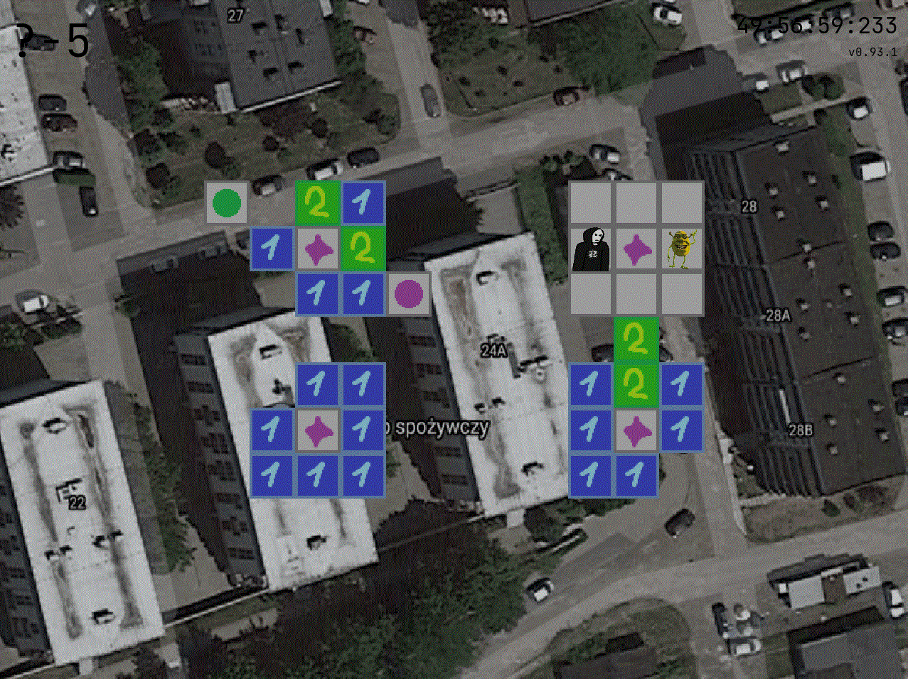

# Version 1.0 is finally here, go play it!

## Maze of Tiles

Maze of Tiles, also known as klockilol4dupf, is puzzle game, where you must step on tiles the exact number of times that is specified on them! How challenging can it be?

## Engaging puzzles

## NP-Complete concept

## Overly complicated levels

## Questionable design choices

## The Idea

The concept is inspired by a hazy memory of a Flash game from the late 2000s called [Platform Maze](https://www.newgrounds.com/portal/view/360130) by Bobberticus.
Another Flash game with a similar idea is Birdy's Rainy Day Skipathon by Jess Hansen.
Both of those can be found on [Flash Point](https://bluemaxima.org/flashpoint/)) by BlueMaxima.
Klockilol4dupf integrates mechanics and levels from both games as extra zones."

## Features:

- Ten main zones, each with a different gimmick, containing over 200 puzzles in total!
- The ability to undo any mistakes you make!
- A witch, that serves as a narrator! She speaks either Polish or English.
- Speedrun helpers, including as a timer and commands setting up specific runs!
- Several extra zones for players hungry for more!
- An easy-to-learn level creation process based on txt files!

## Upcoming features:

- The addition of a way to skip levels.
- An in-game display of the control scheme.
- Hold a direction to continue moving that way.
- Newlines support in messages.
- Return to the game in the stage you exited.
- A way to type in commands while in controls_display mode (mixed state?)
- Revamp birdy and pm lobbies.
- More extra zones!
- Any other suggestions that I find cool.

## Installation

For <b>Windows 10/11</b>: 
1) Download this repo ('Code' -> 'Download ZIP').
2) Create a new folder and unzip there.
3) Run klockilol4dupf.exe (located in the `game` folder).

**Do NOT move the .exe file away from that folder.** You can create a shortcut though. 

Windows Defender will likely stop the game from running. CLick on 'more info' -> 'run anyway', if you trust me enough. Do NOT close the console window.
  

For <b>Linux</b>: 

Simply clone the repo and run launcher.py; it should work.
  

If you want to create an .exe yourself, use `pyinstaller --onefile .\klockilol4dupf.py`. 
The result will generate in the `dist` directory, and needs to be moved to the `game` directory to function properly.

When transitioning between devices, you can transfer your progress by copying the save folder and pasting it onto the new device.

## Speedrun command AAAAA

Commands are available after pressing Enter while in game. 
The speedrun command automatically sets up speedruns for you.
**IT ERASES THE CURRENT SAVE FILE!!!**

- speedrun - initiate a speedrun based on the provided arguments.   
    WARNING: this command wipes your save! You can back it up by copying files from `game/src/data`  
    Available speedruns:
  - platform maze (pm)
  - birdy's rainy day skipathon (birdy)
  - shrek%
  - 100%  

## Dependencies
* NumPy
* pygame
* Tkinter
* pickle
